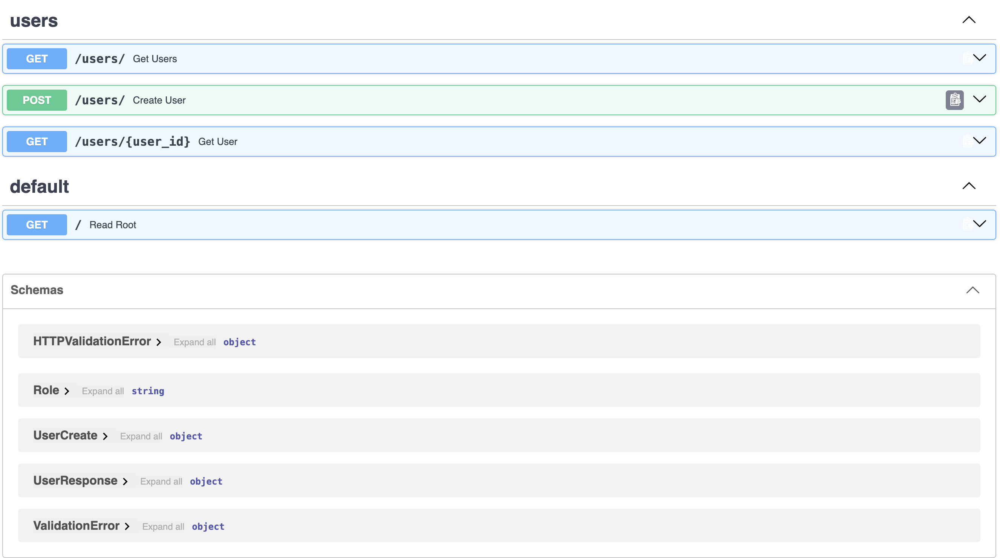
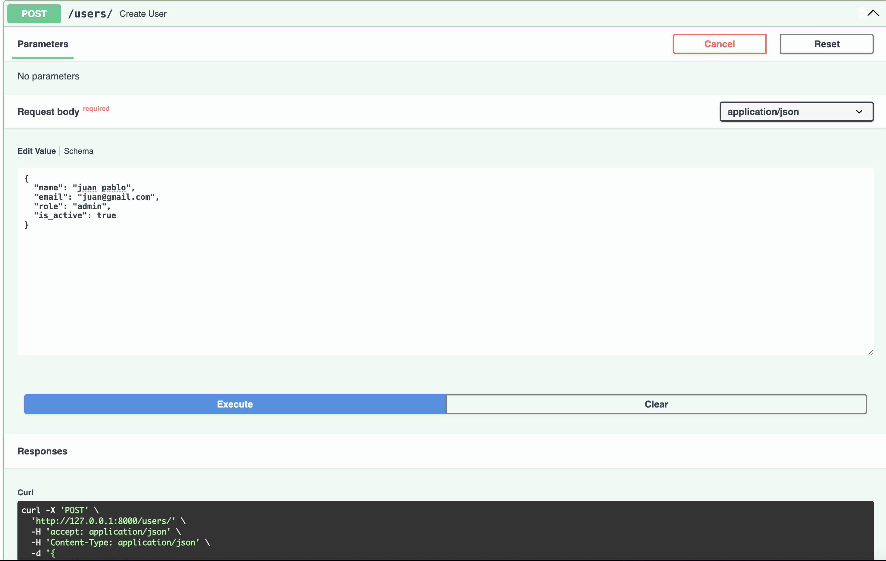
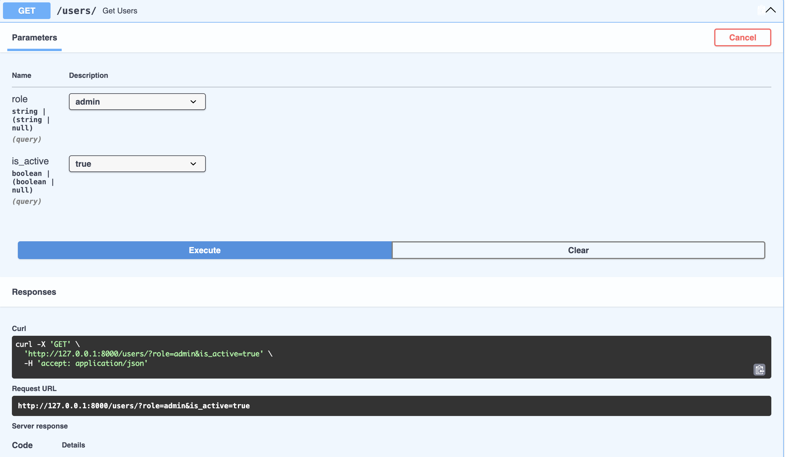
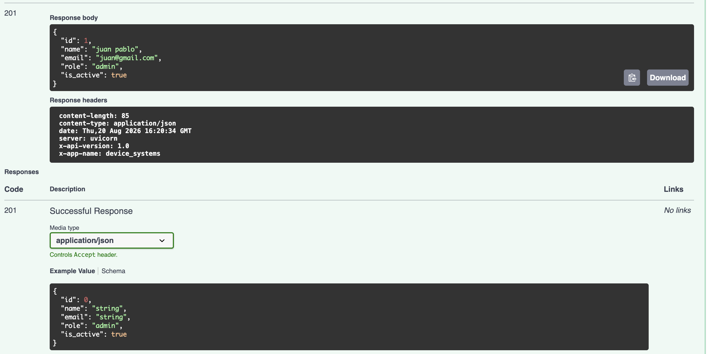
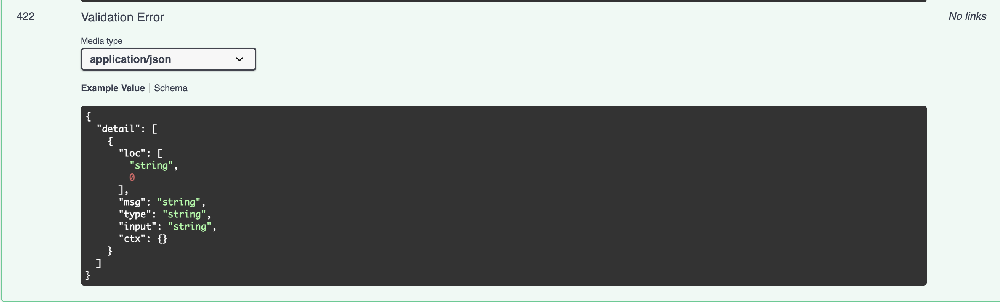

# device_systems

API REST para la gestión de usuarios del sistema device_systems, construida con FastAPI y Pydantic v2.

## Instalación

```bash
python3 -m venv venv
source venv/bin/activate
pip install -r requirements.txt
```

## Ejecución del servidor

```bash
uvicorn app.main:app --reload
```

El servidor estará disponible en: `http://127.0.0.1:8000`

Documentación Swagger UI: `http://127.0.0.1:8000/docs`

## Tabla de endpoints

| Método | Ruta             | Descripción                          | Parámetros                                  |
|--------|------------------|--------------------------------------|---------------------------------------------|
| GET    | `/users/`        | Listar todos los usuarios            | `role` (query), `is_active` (query)         |
| GET    | `/users/{id}`    | Obtener un usuario por ID            | `user_id` (path)                            |
| POST   | `/users/`        | Registrar un nuevo usuario           | Body JSON (name, email, role, is_active)    |

## Cabeceras HTTP personalizadas

Todas las respuestas incluyen:

- `X-App-Name: device_systems`
- `X-API-Version: 1.0`

## Ejemplos de peticiones

### GET /users/

```bash
curl http://127.0.0.1:8000/users/
```

### GET /users/ con filtro por rol

```bash
curl "http://127.0.0.1:8000/users/?role=admin"
```

### GET /users/ con filtro por estado

```bash
curl "http://127.0.0.1:8000/users/?is_active=true"
```

### GET /users/{user_id}

```bash
curl http://127.0.0.1:8000/users/1
```

### POST /users/

```bash
curl -X POST http://127.0.0.1:8000/users/ \
  -H "Content-Type: application/json" \
  -d '{
    "name": "Juan Perez",
    "email": "juan@test.com",
    "role": "admin",
    "is_active": true
  }'
```

## Validaciones Pydantic

- **name**: obligatorio, mínimo 3 caracteres
- **email**: formato de correo válido
- **role**: solo valores `admin`, `support`, `user`
- **is_active**: valor booleano (true/false)
- **correo duplicado**: retorna error 400

## Tecnologías

- Python 3
- FastAPI
- Pydantic v2
- Uvicorn

## Evidencias

### Raíz del proyecto


### Endpoints disponibles



### Crear usuario (POST)



### Búsqueda de usuario por ID


### Búsqueda por rol


### Filtrado por rol admin



### Prueba con Curl



### Validaciones de errores


